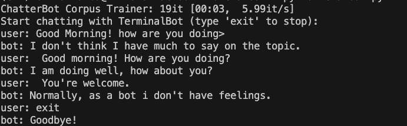

## 🛠 Setup and Run Instructions

First, make sure Python 3.9 is installed on your system. This version is required because ChatterBot is not compatible with Python 3.10 or higher.

Then, follow these steps:

1. **Clone the repository** and navigate into it:
   ```bash
   git clone https://github.com/Rumba19/Chatbot
   cd Chatbot
---
2. **Create and activate a virtual environment**:
    ````bash
        python3.9 -m venv env
        source env/bin/activate


---
3. **Install the required dependencies**:
    ````bash
        pip install --upgrade pip setuptools wheel
        pip install chatterbot==1.2.6
        pip install chatterbot_corpus==1.2.2
        pip install django==3.2
        pip install spacy==3.8.0
        pip install pyyaml
        python -m spacy download en_core_web_sm
---
4. **Run the chatbot**:
    ````bash
    python chatbot.py

**The bot will train on the English corpus and then start an interactive session.**

---
5. **Sample Output**
